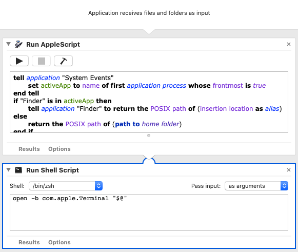
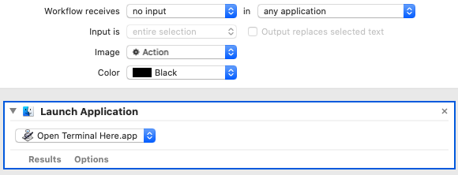

# Open Terminal Shortcut in macOS

How to create a keyboard shortcut to open a new terminal at your current 
Finder location.  Like Ctrl+Alt+T / Alt+T in some Linux distros.

## Automator App



Open Automator and create a new Application.  Add the following actions:

1. Run Applescript:

	```applescript
	tell application "System Events"
		set activeApp to name of first application process whose frontmost is true
	end tell
	if "Finder" is in activeApp then
		tell application "Finder" to return the POSIX path of (insertion location as alias)
	else
		return the POSIX path of (path to home folder)
	end if
	```

2. Run Shell Script: `open -b com.apple.Terminal "$@"`
	- **Make sure "Pass input" is set to "as arguments"**

Save the Application as "Open Terminal Shortcut.app" and place it in your 
Applications or Utilities folder.

These actions could go directly in the Automator Quick Action (see below); however, 
if you place them in the quick action, the foreground Application running 
when you launch the service will need "access to control" System Events and 
Finder.  That may be fine, if you only use the service while using Finder, but 
if you launch it when any other app is open, you will need to grant these
permissions for each new app.  It is far more convenient to create a 
separate app and grant the permissions only once.

## Automator Quick Action



With Automator, create a new Quick Action.  Simply:

1. Launch Application: "Open Terminal Shortcut.app"

Save the Quick Action as "Open Terminal Shortcut".

## Assigning a Keyboard Shortcut

In System Preferences -> Keyboard -> Shortcuts under Services -> General, 
assign a shortcut for "Open Terminal Shortcut".  I used Ctrl + Alt + Cmd + T.


